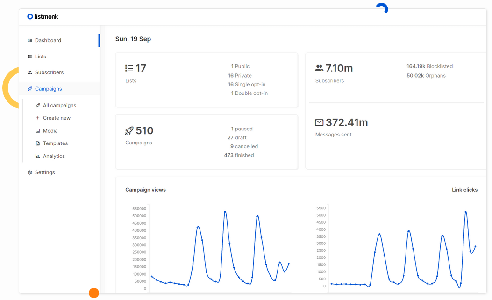
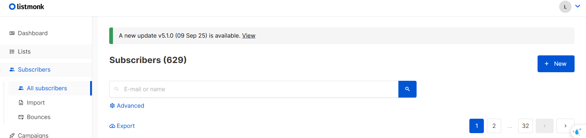
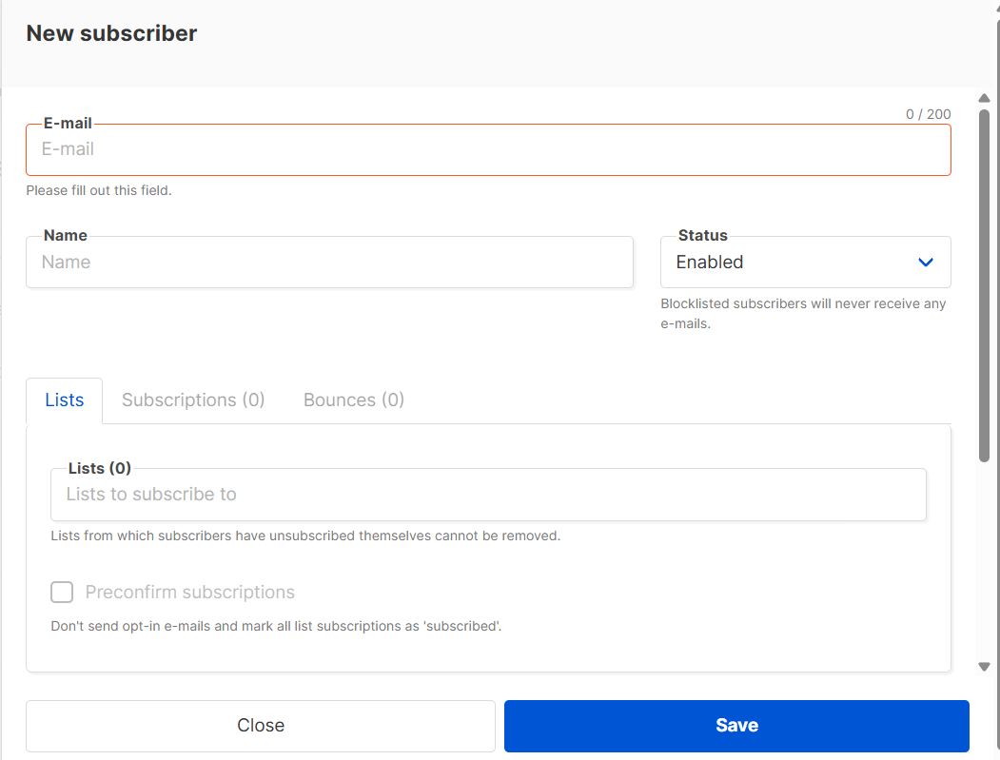
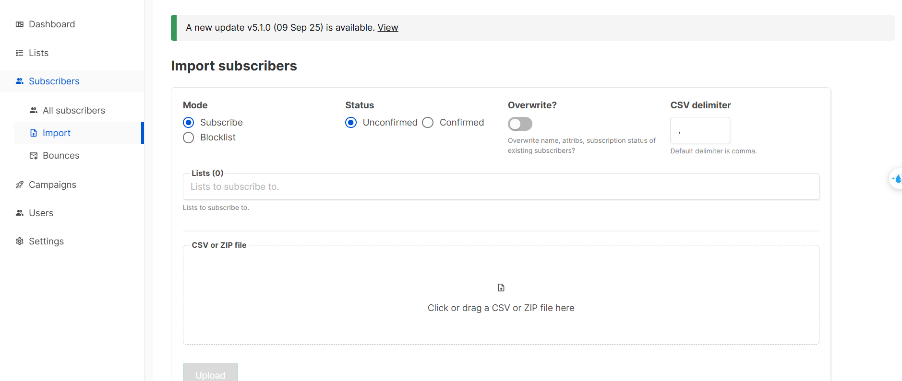
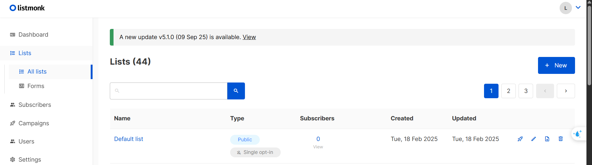
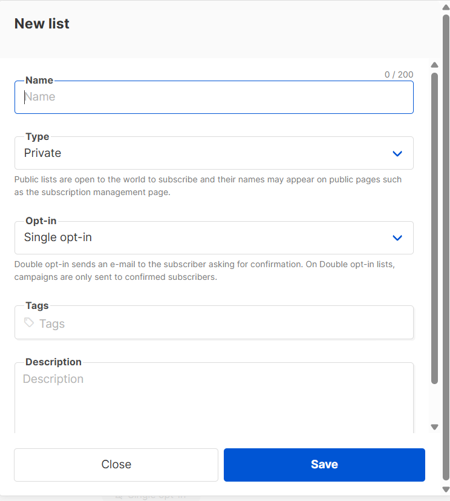
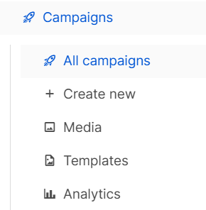
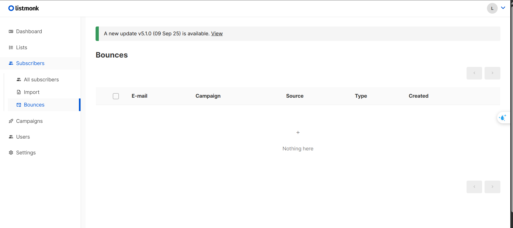

# listmonk/Documentation
- [listmonk/Documentation](#listmonkdocumentation)
- [Giới thiệu](#giới-thiệu)
- [Cách sử dụng](#cách-sử-dụng)
- [Concepts (Các khái niệm cơ bản)](#concepts-các-khái-niệm-cơ-bản)
  - [Subscriber (Người đăng ký)](#subscriber-người-đăng-ký)
  - [Attributes (Thuộc tính)](#attributes-thuộc-tính)
  - [Subscription statuses (Trạng thái đăng ký)](#subscription-statuses-trạng-thái-đăng-ký)
  - [Segmentation (Phân nhóm)](#segmentation-phân-nhóm)
  - [List (Danh sách gửi mail)](#list-danh-sách-gửi-mail)
  - [](#)
  - [Campaign (Chiến dịch)](#campaign-chiến-dịch)
  - [Transactional message (Thông báo giao dịch)](#transactional-message-thông-báo-giao-dịch)
  - [Template (Mẫu email)](#template-mẫu-email)
  - [Messenger (Trình gửi tin nhắn)](#messenger-trình-gửi-tin-nhắn)
  - [Tracking pixel (Pixel theo dõi)](#tracking-pixel-pixel-theo-dõi)
  - [Click tracking (Theo dõi nhấp chuột)](#click-tracking-theo-dõi-nhấp-chuột)
  - [Bounce (Email bị trả lại)](#bounce-email-bị-trả-lại)
  - [](#-1)
- [Templating (Mẫu email)](#templating-mẫu-email)
  - [Tổng quan](#tổng-quan)
  - [Loại Template](#loại-template)
    - [Campaign templates (Mẫu chiến dịch)](#campaign-templates-mẫu-chiến-dịch)
    - [Transactional templates (Mẫu thông báo giao dịch)](#transactional-templates-mẫu-thông-báo-giao-dịch)
  - [Template expressions (Biểu thức mẫu)](#template-expressions-biểu-thức-mẫu)
    - [Subscriber fields (Trường thông tin người đăng ký)](#subscriber-fields-trường-thông-tin-người-đăng-ký)
    - [Campaign fields (Trường thông tin chiến dịch)](#campaign-fields-trường-thông-tin-chiến-dịch)
    - [Template functions (Hàm có sẵn)](#template-functions-hàm-có-sẵn)
    - [Sprig functions](#sprig-functions)
  - [Example template (Ví dụ mẫu HTML)](#example-template-ví-dụ-mẫu-html)
  - [Example campaign body (Ví dụ nội dung chiến dịch)](#example-campaign-body-ví-dụ-nội-dung-chiến-dịch)
  - [System templates (Mẫu hệ thống)](#system-templates-mẫu-hệ-thống)
    - [Public pages](#public-pages)
    - [System e-mails](#system-e-mails)
- [Querying and Segmenting Subscribers (Truy vấn và phân nhóm người đăng ký)](#querying-and-segmenting-subscribers-truy-vấn-và-phân-nhóm-người-đăng-ký)
  - [Database fields (Các trường dữ liệu có thể truy vấn)](#database-fields-các-trường-dữ-liệu-có-thể-truy-vấn)
  - [Sample attributes (Ví dụ dữ liệu thuộc tính)](#sample-attributes-ví-dụ-dữ-liệu-thuộc-tính)
  - [Sample SQL query expressions (Ví dụ truy vấn SQL)](#sample-sql-query-expressions-ví-dụ-truy-vấn-sql)
    - [Tìm subscriber theo e-mail](#tìm-subscriber-theo-e-mail)
    - [Tìm subscriber theo tên](#tìm-subscriber-theo-tên)
    - [Kết hợp nhiều điều kiện](#kết-hợp-nhiều-điều-kiện)
    - [Tìm subscriber đã xem email chiến dịch](#tìm-subscriber-đã-xem-email-chiến-dịch)
    - [Truy vấn theo thuộc tính (Attributes)](#truy-vấn-theo-thuộc-tính-attributes)
    - [Truy vấn thuộc tính lồng nhau (Nested attributes)](#truy-vấn-thuộc-tính-lồng-nhau-nested-attributes)
  - [Tóm tắt](#tóm-tắt)


# Giới thiệu
- **listmonk** là một trình quản lý bản tin và danh sách gửi thư một chiều hiệu suất cao, tự lưu trữ. Nó có dạng nhị phân độc lập và phần phụ thuộc duy nhất là cơ sở dữ liệu **Postgres**.



---

# Cách sử dụng
# Concepts (Các khái niệm cơ bản)

## Subscriber (Người đăng ký)

**Subscriber** là người nhận email, được xác định bằng **địa chỉ email** và **tên**.  
Các subscriber là những người sẽ nhận email được gửi từ **Listmonk**.  
Mỗi subscriber có thể được thêm vào **nhiều danh sách (lists)** khác nhau.  
Nếu một subscriber **không thuộc danh sách nào**, họ được xem là **bản ghi mồ côi (orphan record)**.


Có 2 cách thêm **subscribers** mới:
**Cách 1: Thêm thủ công** 
- Bước 1: Vào mục **Subscribers -> All subscribers**. Ở đây là phần quản lý các subcrisbers, có danh sách, tìm kiếm.... Chọn nút **New**


- Bước 2 : Ở đây sẽ có hộp thoại để bạn điền thông tin subscrisber mới



- Bước 3: Nhấn Save để hoàn thành

**Cách 2: import file** cách này có thể thêm một lúc nhiều subscribers nếu ta đã có sẵn danh sách
- Bước 1 : Vào mục mục **Subscribers -> Import**

- Bước 2 : Chọn file zip hoặc file csv để import, và cài đặt các thông số
- Bước 3 : Upload

---

## Attributes (Thuộc tính)
**Attributes** là các thông tin bổ sung gắn với một subscriber ngoài **email** và **tên**(đây là 2 thuộc tính chính), ví dụ như “thành phố”, “ngôn ngữ”, “sở thích”.  
Chúng được lưu dưới dạng **JSON**, và mỗi subscriber có thể có các thuộc tính khác nhau.

Các thuộc tính giúp bạn:
- **Phân nhóm (segment)** người nhận theo điều kiện (ví dụ: thành phố = Hà Nội).  
- **Chèn dữ liệu cá nhân hóa vào email** (ví dụ: “Xin chào {{name}} đến từ {{city}}”).  

**Ví dụ:**
```json
{
  "city": "Bengaluru",
  "likes_tea": true,
  "spoken_languages": ["English", "Malayalam"],
  "projects": 3,
  "stack": {
    "frameworks": ["echo", "go"],
    "languages": ["go", "python"],
    "preferred_language": "go"
  }
}
```

---

## Subscription statuses (Trạng thái đăng ký)
Mỗi subscriber khi tham gia một danh sách (list) có thể có **một trong các trạng thái sau**:

| Trạng thái | Mô tả |
|-------------|-------|
| `unconfirmed` | Người đăng ký được thêm trực tiếp vào danh sách **chưa xác nhận** qua email. Họ vẫn có thể nhận email từ các chiến dịch **single opt-in**. |
| `confirmed` | Người đăng ký đã **xác nhận đăng ký** bằng cách bấm “chấp nhận” trong email xác nhận. Chỉ những người này mới nhận email trong **double opt-in lists**. |
| `unsubscribed` | Người đăng ký đã **hủy đăng ký**, không còn nhận email từ danh sách. |

---

## Segmentation (Phân nhóm)
**Segmentation** là quá trình **lọc** một danh sách lớn thành nhóm nhỏ dựa trên các điều kiện, thường là theo **attributes**.  
Ví dụ: bạn có thể gửi email **chỉ cho người ở TP.HCM**, nếu thuộc tính “city” của họ là “HCM”.

---

## List (Danh sách gửi mail)
**List** (hay **Mailing list**) là một **nhóm các subscriber** được gom lại dưới một tên, ví dụ: “Khách mời”, “Khóa D22 ”, "Khóa D23",..

Có 2 loại danh sách:
- **Single opt-in**: Người dùng được thêm vào là nhận ngay email.
- **Double opt-in**: Người dùng phải **xác nhận qua email** trước khi nhận thư.


Tạo một list mới 


---

## Campaign (Chiến dịch)
**Campaign** là **một email hoặc chuỗi email** được gửi đến **một hoặc nhiều lists**.  
Ví dụ: chiến dịch “Giới thiệu sản phẩm mới” gửi đến tất cả khách hàng trong danh sách “Subscribers 2025”.



Các mục ở phần campaigns:
- **All campaigns** : Danh sách các campaign hiện có
- **Create New** : Tạo các campaign mới
- **Meida** : Đây là kho media (media library/manager) để tải lên, quản lý và chèn tệp vào nội dung chiến dịch (đặc biệt là ảnh dùng trong HTML email).
- **Template** : tạo các mẫu hiển thị cho các campaigns
- **Analytics** : Phần thông kê số lượng  các thư đã gửi dựa trên các trạng thái như **Views**(Đã xem), **Clicks**(Đã nhấn vào), **Bounces**(Thư gửi thất bại). Đây mục tự động thống kê
---

## Transactional message (Thông báo giao dịch)
**Transactional message** là **email tự động gửi cá nhân** đến từng subscriber thông qua API — thường gắn với một hành động cụ thể.  
Ví dụ:
- Email **chào mừng** khi người dùng đăng ký.  
- Email **xác nhận đơn hàng** sau khi mua hàng.  
- Email **đặt lại mật khẩu**.

---

## Template (Mẫu email)
**Template** là **bố cục HTML có sẵn** dùng lại cho nhiều chiến dịch hoặc email tự động.  
Thông thường, template chứa:
- **Phần đầu & chân trang cố định** (logo, thông tin công ty)
- **Phần nội dung thay đổi** ở giữa (nội dung chiến dịch)

Listmonk hỗ trợ **Go template expressions**, cho phép tạo **email động**, ví dụ:
```go
{{ if eq .city "Hanoi" }}Xin chào người Hà Nội!{{ end }}
```
- Có thể dùng các web kéo thả để tạo mẫu Template mà không cần code, ở phần templating sẽ nói rõ hơn
---

## Messenger (Trình gửi tin nhắn)
Ngoài gửi email qua **SMTP**, Listmonk còn hỗ trợ **Messenger** — các dịch vụ gửi tin nhắn tuỳ chỉnh.  
Điều này cho phép gửi:
- **SMS**
- **Thông báo FCM (Firebase Cloud Messaging)**
- Hoặc các hình thức khác

**Messenger** là một dịch vụ web nhận **nội dung chiến dịch dưới dạng JSON** và phát tán nó (ví dụ gửi SMS qua API).

---

## Tracking pixel (Pixel theo dõi)
**Tracking pixel** là một **hình ảnh vô hình nhỏ xíu** chèn vào email để theo dõi việc mở thư.  
Nhờ đó, bạn biết **tỷ lệ người đọc email**.  
Tuy nhiên, việc này có thể ảnh hưởng đến **quyền riêng tư**, nên cần tuân thủ các quy định như **GDPR**.  
Listmonk cũng hỗ trợ **ẩn danh hoá** việc theo dõi (không gắn với người cụ thể).

---

## Click tracking (Theo dõi nhấp chuột)
Listmonk có thể theo dõi **mọi đường link trong email** — giúp đo **tỷ lệ click (CTR)**.  
Cũng như pixel, bạn nên **tuân thủ quy định bảo mật** khi dùng tính năng này, và có thể bật chế độ **ẩn danh**.

---

## Bounce (Email bị trả lại)
**Bounce** xảy ra khi email **không thể gửi đến người nhận** — có thể do:
- Địa chỉ không tồn tại
- Hộp thư đầy
- Nhà cung cấp chặn email hoặc đánh dấu spam

Listmonk có thể **xử lý tự động các email bị trả lại** thông qua:
- **Hộp thư POP** được cấu hình sẵn  
- **API của nhà cung cấp SMTP** (như AWS SES, SendGrid)

Dựa trên cài đặt, các subscriber bị **bounce** có thể được **chặn (blocklist)** hoặc **xóa tự động**.


---

#  Templating (Mẫu email)

## Tổng quan

**Template** là **bản thiết kế HTML có thể tái sử dụng**, dùng cho cả **chiến dịch (campaign)** và **thông báo tự động (transactional message)**.
Thông thường, template có **phần đầu (header)** và **phần chân (footer)** cố định chứa logo và nhận diện thương hiệu, còn **nội dung chiến dịch** sẽ được chèn vào giữa.

Listmonk hỗ trợ **Go template expressions** giúp tạo các **mẫu email động (dynamic templates)**, và tích hợp hơn **100 hàm tiện ích từ thư viện Sprig**. [Tài liệu Sprig Template Functions](https://masterminds.github.io/sprig/)

---

## Loại Template

### Campaign templates (Mẫu chiến dịch)

Dùng trong **email campaigns**.
Tạo và quản lý tại **Campaigns → Templates** trong giao diện Listmonk.
Khi tạo chiến dịch mới, bạn sẽ chọn mẫu này để chèn nội dung.

### Transactional templates (Mẫu thông báo giao dịch)

Dùng cho **email tự động gửi cá nhân** (qua Transactional API).
Ví dụ: Email xác nhận đơn hàng, chào mừng người dùng mới, hoặc đặt lại mật khẩu.
Cũng được quản lý tại **Campaigns → Templates**.

---

## Template expressions (Biểu thức mẫu)

Các biểu thức được viết trong cặp dấu `{{ ... }}`, ví dụ:

```go
{{ .Subscriber.Email }}
```
Các biểu thức giúp ta lấy ra các thông tin động để chèn vào Template(mẫu):
Ví dụ: 
- **Subscriber** "A" có name là "A" -> {{ .Subscriber.Name }}	sẽ trả ra "A", tương tự là B có tên là "B" thì sẽ trả ra B cho bên **template** hiển thị

### Subscriber fields (Trường thông tin người đăng ký)

| Biểu thức                     | Mô tả                                                                            |
| ----------------------------- | -------------------------------------------------------------------------------- |
| `{{ .Subscriber.UUID }}`      | ID ngẫu nhiên duy nhất của subscriber                                            |
| `{{ .Subscriber.Email }}`     | Địa chỉ email                                                                    |
| `{{ .Subscriber.Name }}`      | Tên đầy đủ                                                                       |
| `{{ .Subscriber.FirstName }}` | Tên riêng (tự tách từ Name)                                                      |
| `{{ .Subscriber.LastName }}`  | Họ (tự tách từ Name)                                                             |
| `{{ .Subscriber.Status }}`    | Trạng thái (enabled, disabled, blocklisted)                                      |
| `{{ .Subscriber.Attribs }}`   | Bản đồ các thuộc tính tùy ý, truy cập bằng `.`, ví dụ `.Subscriber.Attribs.city` |
| `{{ .Subscriber.CreatedAt }}` | Thời điểm thêm subscriber                                                        |
| `{{ .Subscriber.UpdatedAt }}` | Thời điểm cập nhật subscriber                                                    |

---

### Campaign fields (Trường thông tin chiến dịch)

| Biểu thức                   | Mô tả                      |
| --------------------------- | -------------------------- |
| `{{ .Campaign.UUID }}`      | ID duy nhất của chiến dịch |
| `{{ .Campaign.Name }}`      | Tên nội bộ của chiến dịch  |
| `{{ .Campaign.Subject }}`   | Tiêu đề email              |
| `{{ .Campaign.FromEmail }}` | Địa chỉ email người gửi    |

---

### Template functions (Hàm có sẵn)

| Hàm                                  | Mô tả                                                  |
| ------------------------------------ | ------------------------------------------------------ |
| `{{ Date "2006-01-01" }}`            | Hiển thị ngày giờ hiện tại theo định dạng Go           |
| `{{ TrackLink "https://link.com" }}` | Tạo URL có thể theo dõi lượt click                     |
| `https://link.com@TrackLink`         | Cú pháp rút gọn cho `TrackLink`                        |
| `{{ TrackView }}`                    | Thêm 1 pixel theo dõi lượt mở email (nên đặt ở footer) |
| `{{ UnsubscribeURL }}`               | Liên kết hủy đăng ký hoặc quản lý tùy chọn             |
| `{{ MessageURL }}`                   | Liên kết xem bản online của email                      |
| `{{ OptinURL }}`                     | Liên kết xác nhận đăng ký (double opt-in)              |
| `{{ Safe "<!-- comment -->" }}`      | Chèn trực tiếp HTML không bị escape                    |

---

### Sprig functions

Listmonk tích hợp thư viện **Sprig**, cung cấp **100+ hàm tiện ích** để thao tác với chuỗi, số, ngày tháng,... trong template.

Xem thêm tại [Sprig documentation](https://masterminds.github.io/sprig/).

---

## Example template (Ví dụ mẫu HTML)

Trong mỗi template cần có **biểu thức chèn nội dung chính**:

```go
{{ template "content" . }}
```

Mẫu HTML hoàn chỉnh ví dụ:

```html
<!DOCTYPE html>
<html>
  <head>
    <style>
      body { background: #eee; font-family: Arial, sans-serif; font-size: 6px; color: #111; }
      header { border-bottom: 1px solid #ddd; padding-bottom: 30px; margin-bottom: 30px; }
      .container { background: #fff; width: 450px; margin: 0 auto; padding: 30px; }
    </style>
  </head>
  <body>
    <section class="container">
      <header>
        <!-- Phần header cố định cho mọi email -->
        Hi {{ .Subscriber.FirstName }}!
      </header>

      <!-- Nội dung email sẽ được chèn tại đây -->
      <div class="content">
        {{ template "content" . }}
      </div>

      <footer>
        Copyright 2019. All rights Reserved.
      </footer>

      <!-- Pixel theo dõi lượt đọc -->
      {{ TrackView }}
    </section>
  </body>
</html>
```

    *Nếu dùng email dạng văn bản (plaintext)* → chỉ cần để `{{ template "content" . }}` mà không có HTML.

- **Bonus**: Chúng ta có thể dùng các **app/web kéo thả** để tạo template rồi lấy đoạn HTML được tạo ra dán vào phần này. Ví dụ như  https://beefree.io/ ,...

---

## Example campaign body (Ví dụ nội dung chiến dịch)

```html
Hey, did you notice how the template showed your first name?
Your last name is {{ .Subscriber.LastName }}.

You have done {{ .Subscriber.Attribs.projects }} projects.

{{ if eq .Subscriber.Attribs.city "Bengaluru" }}
  You live in Bangalore!
{{ else }}
  Where do you live?
{{ end }}

Here is a link for you to click that will be tracked:
<a href="{{ TrackLink "https://google.com" }}">Google</a>
```

Biểu thức `if` ở trên kiểm tra điều kiện (`city == Bengaluru`) và hiển thị nội dung khác nhau tùy thuộc dữ liệu người nhận.
Bạn có thể tạo nhiều logic động tương tự trong Go templating.

---

## System templates (Mẫu hệ thống)

Được dùng để **render các trang công khai** (như trang quản lý đăng ký) và **email hệ thống tự động** (như email xác nhận opt-in).

Các file này nằm trong thư mục `static/`, có thể **tuỳ chỉnh giao diện** bằng cách sao chép về máy và chạy:

```bash
mkdir -p /home/ubuntu/listmonk/static
wget -O - https://github.com/knadh/listmonk/archive/master.tar.gz | tar xz -C /home/ubuntu/listmonk/static --strip=2 "listmonk-master/static"
```

---

### Public pages

| Đường dẫn                   | Mô tả                                        |
| --------------------------- | -------------------------------------------- |
| `/static/public/index.html` | Template cơ bản cho tất cả các trang         |
| `home.html`                 | Trang chủ với nút đăng nhập                  |
| `message.html`              | Trang thông báo chung (thành công/thất bại)  |
| `optin.html`                | Trang xác nhận đăng ký                       |
| `subscription.html`         | Trang quản lý đăng ký (xóa hoặc tải dữ liệu) |
| `subscription-form.html`    | Trang chọn danh sách và đăng ký              |

Tuỳ chỉnh CSS/JS tại:
**Settings → Appearance → Public**

---

###  System e-mails

| Đường dẫn                        | Mô tả                                                 |
| -------------------------------- | ----------------------------------------------------- |
| `base.html`                      | Template gốc cho mọi email hệ thống                   |
| `campaign-status.html`           | Thông báo cho admin khi chiến dịch bắt đầu/kết thúc   |
| `import-status.html`             | Thông báo khi quá trình import hoàn tất               |
| `subscriber-data.html`           | Email gửi dữ liệu cá nhân cho người dùng theo yêu cầu |
| `subscriber-optin.html`          | Email xác nhận đăng ký (double opt-in)                |
| `subscriber-optin-campaign.html` | Nội dung opt-in chèn vào chiến dịch opt-in            |
| `default.tpl`                    | Template mặc định được tạo khi cài đặt lần đầu        |

 *Nếu muốn chuyển sang email văn bản (plaintext)*:
Xóa `<!doctype html>` và tất cả thẻ HTML, chỉ giữ lại **các biểu thức Go template**.

---

# Querying and Segmenting Subscribers (Truy vấn và phân nhóm người đăng ký)

Listmonk cho phép viết **biểu thức SQL (Postgres)** để **truy vấn, lọc, và phân nhóm subscribers**.
Điều này giúp tạo các tập con người nhận dựa trên email, trạng thái, hoặc thuộc tính (attributes) của họ.

---

## Database fields (Các trường dữ liệu có thể truy vấn)

| Trường                   | Mô tả                                                                                                     |
| ------------------------ | --------------------------------------------------------------------------------------------------------- |
| `subscribers.uuid`       | ID ngẫu nhiên duy nhất của subscriber                                                                     |
| `subscribers.email`      | Địa chỉ e-mail của subscriber                                                                             |
| `subscribers.name`       | Tên của subscriber                                                                                        |
| `subscribers.status`     | Trạng thái của subscriber (`enabled`, `disabled`, `blocklisted`)                                          |
| `subscribers.attribs`    | Bản đồ các thuộc tính (attributes) lưu dưới dạng JSON; truy cập bằng toán tử `->` và `->>` trong Postgres |
| `subscribers.created_at` | Thời điểm thêm subscriber                                                                                 |
| `subscribers.updated_at` | Thời điểm cập nhật subscriber                                                                             |

---

## Sample attributes (Ví dụ dữ liệu thuộc tính)

Ví dụ JSON của một subscriber:

```json
{
  "city": "Bengaluru",
  "likes_tea": true,
  "spoken_languages": ["English", "Malayalam"],
  "projects": 3,
  "stack": {
    "frameworks": ["echo", "go"],
    "languages": ["go", "python"],
    "preferred_language": "go"
  }
}
```

---

## Sample SQL query expressions (Ví dụ truy vấn SQL)

### Tìm subscriber theo e-mail

```sql
-- Khớp chính xác
subscribers.email = 'some@domain.com'

-- Khớp một phần: tìm email kết thúc bằng @domain.com
subscribers.email LIKE '%@domain.com'
```

---

### Tìm subscriber theo tên

```sql
-- Tìm tất cả subscriber có tên bắt đầu bằng John
subscribers.name LIKE 'John%'
```

---

### Kết hợp nhiều điều kiện

```sql
-- Tìm tất cả John bị blocklisted
subscribers.name LIKE 'John%' AND status = 'blocklisted'
```

---

### Tìm subscriber đã xem email chiến dịch

```sql
-- Tìm tất cả subscriber đã xem email của campaign có ID cụ thể
EXISTS(
  SELECT 1
  FROM campaign_views
  WHERE campaign_views.subscriber_id = subscribers.id
    AND campaign_views.campaign_id = <put_id_of_campaign>
)
```

---

### Truy vấn theo thuộc tính (Attributes)

```sql
-- Toán tử ->> trả về giá trị dạng text
-- Tìm tất cả subscriber ở Bengaluru và có hơn 3 project
-- Ở đây 'projects' được ép kiểu sang INT để có thể so sánh số
subscribers.attribs->>'city' = 'Bengaluru'
  AND (subscribers.attribs->>'projects')::INT > 3
```

---

### Truy vấn thuộc tính lồng nhau (Nested attributes)

```sql
-- Tìm tất cả subscriber bị blocklisted, thích uống trà, biết Python,
-- và ngôn ngữ lập trình ưa thích là Go

subscribers.status = 'blocklisted'
  AND (subscribers.attribs->>'likes_tea')::BOOLEAN = true
  AND subscribers.attribs->'stack'->'languages' ? 'python'
  AND subscribers.attribs->'stack'->>'preferred_language' = 'go'
```

> Ghi chú:
>
> * `->` trả về cấu trúc JSON
> * `->>` trả về giá trị dạng text
> * Toán tử `?` dùng để kiểm tra **sự tồn tại** của giá trị trong danh sách

---

 **Tham khảo thêm:**
 [PostgreSQL JSONB Documentation](https://www.postgresql.org/docs/current/functions-json.html) — để viết các truy vấn nâng cao trên dữ liệu JSON.

---

## Tóm tắt

Nếu bạn **không viết SQL**, hãy hiểu đơn giản:

* Các “truy vấn” này giúp **lọc người nhận email** theo điều kiện rất cụ thể (ví dụ “sống ở Hà Nội”, “đã mở email gần đây”, “đã hoàn thành >3 dự án”).
* Thông thường, giao diện Listmonk sẽ cho bạn chọn điều kiện này bằng form, **không cần gõ SQL**.
* Dev chỉ cần biết để **tạo segment động** hoặc **tự động hóa chiến dịch**.

---


